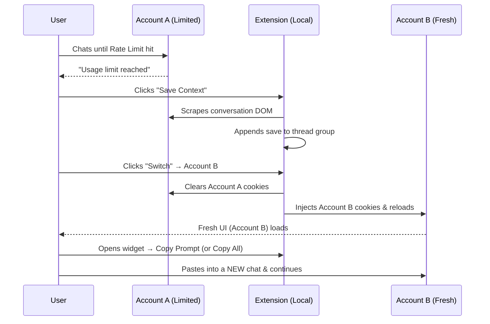
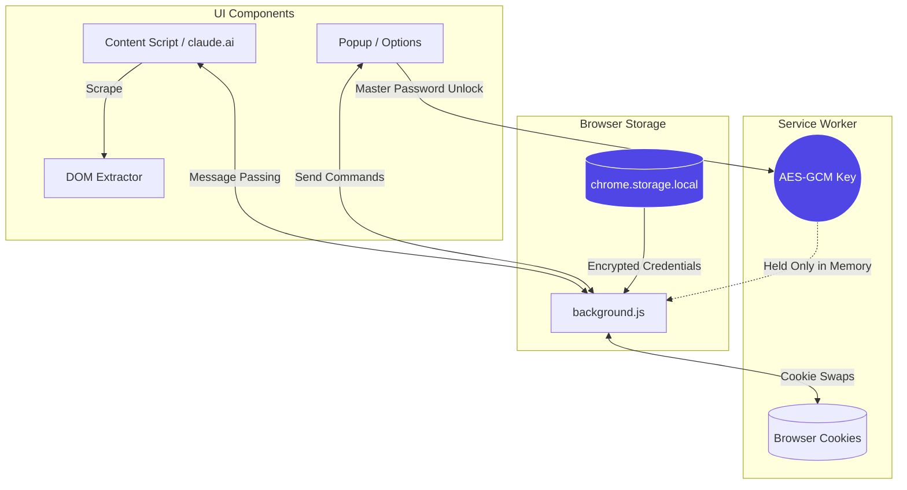

# Claude Session Manager

A powerful, privacy-first Chrome Extension for managing multiple Claude.ai accounts, seamless session switching, and intelligent context handoffs. Built specifically to solve the friction of hitting Claude's rate limits and needing to jump to a secondary account.


<!-- 
  To add your own screenshots:
  1. Create a folder named "assets" in the root of this project.
  2. Save your screenshot as "screenshot-main.png" inside that folder.
  3. GitHub will automatically render it here!
-->

## 📌 Features

- **⚡ Instant Account Switching**: Switch between Claude accounts in one click. No logging out, no entering passwords manually, no waiting.
- **🛡️ Privacy First & Local Only**: Your credentials and session cookies are stored *only* on your device. Emails and passwords are encrypted using AES-GCM with a Master Password that is never saved to disk.
- **🧠 Grouped Context History**: Each conversation thread is tracked as a group. Every time you save context (on any account), a sub-entry is appended to that thread's group — so you never lose earlier saves and the full history is always recoverable.
- **📋 Copy Consolidated Prompt**: One click merges all saves for a thread into a single, clean handoff prompt that Claude can read from start to finish.
- **⚠️ Rate Limit Detection**: Automatically detects when you hit Claude's rate limit and prompts you to switch accounts.
- **⚙️ Dynamic Selectors**: Claude updates their UI? No problem. Update the DOM selectors directly in the Options page so context extraction never breaks.
- **🔐 Auto-Lock**: The extension automatically locks its in-memory encryption key after a period of inactivity (default 30 mins) to protect your sessions.

---

## 🚀 Installation

Because this extension requires broad cookie permissions to function, it is best installed in Developer Mode.

1. Clone or download this repository.
2. Open Chrome and navigate to `chrome://extensions/`.
3. Enable **Developer mode** (toggle in the top right corner).
4. Click **Load unpacked** in the top left corner.
5. Select the folder containing `manifest.json`.
6. Pin the extension to your toolbar! ⚡

---

## 🛠️ How to Use

### 1. First-Time Setup
Click the ⚡ extension icon in your toolbar. You will be prompted to create a **Master Password**.
*Keep this password safe. If you lose it, you will have to reset the extension and lose your saved accounts.*

### 2. Adding Accounts
1. Once unlocked, click the **⚙️ Options** gear in the popup (or right-click the extension icon -> Options).
2. Go to the **Accounts** tab and click **+ Add Account**.
3. Give it a label (e.g., "Personal", "Work") and optionally enter your email/password credentials.
4. *To link an account: switch to it in the extension, then manually log into Claude.ai once. The extension saves the session cookies and you can switch instantly from then on.*

### 3. The Claude.ai Widget
When you visit `claude.ai`, a small pill widget appears in the bottom right corner showing your active account.
- Click the pill to open the Quick Action Panel.
- Switch accounts instantly from here.
- **💾 Save Context** — saves the current conversation to history (appends a sub-entry to the current thread group).
- **📋 Copy Prompt** — copies the handoff prompt to clipboard and writes the bridge for the next account.
- **⬇️ Download .txt** — downloads the prompt as a backup file.

### 4. Context Handoff Flow (Recommended Workflow)
When you hit a rate limit:
1. Click **� Save Context** in the widget to save your progress.
2. Click **Switch** on the account you want to move to.
3. On the new account, open a **new chat** and paste the prompt. Claude picks up exactly where you left off.
4. When you're done on Account B and need to return to Account A — repeat: save, switch, new chat, paste.



### 5. Grouped Context History

Every save is stored as a **sub-entry** inside a thread group, never overwriting previous saves. This means the full conversation history across all account switches is always preserved.

**Structure:**
```
Thread: "Dutch A2 writing exam preparation"
  ├─ Save 1 — Account A · 1 Jun 01:06 AM   [Copy] [✕]
  ├─ Save 2 — Account B · 1 Jun 01:09 AM   [Copy] [✕]
  └─ Save 3 — Account A · 1 Jun 01:30 AM   [Copy] [✕]
                               [📋 Copy All] [🗑️ Delete]
```

- **Copy** on any row → copies that single session's prompt.
- **📋 Copy All** → builds a consolidated prompt merging all sessions in order. Earlier sessions are summarised; the latest session is included verbatim. This is the prompt you paste into Claude.

**The bridge mechanism:**

When you copy or download a prompt, the extension writes a lightweight bridge to `chrome.storage.local`:
```json
{ "threadId": "ad31b5fe-...", "originalTitle": "Dutch A2 exam prep", "sourceChatId": "abc-123" }
```
When Account B opens Claude.ai, it reads this bridge. The first Save on Account B inherits the same `threadId` — appending to the existing thread group instead of creating a new one.

> **Note:** The bridge is **consumed** by the first chat that inherits it. If you open a second, unrelated chat on Account B while the bridge is still active, it gets its own fresh group — no cross-contamination.

### 6. Viewing Full History
Open the **📋 Context** tab in the Options page (right-click extension icon → Options) for a full-screen view of all thread groups with timestamps, per-session Copy, and Copy All buttons.

---

## ✅ Best Practices

### Always start a NEW chat on the receiving account

When switching from Account A to Account B (or back), **always open a fresh chat** on the receiving account and paste the context there. Never paste new context into an existing old chat.

**Why:** If you paste into an old chat, the saved context will contain both the original messages AND a summary of those same messages — duplication that compounds with every round-trip.

```
✅ Correct workflow:
Account A chat 1 → [save + switch] → Account B chat 1 (new) → [save + switch] → Account A chat 2 (new)

❌ Avoid:
Account A chat 1 → [switch] → Account B chat 1 → [switch] → Account A chat 1 (same old chat)
```

### Button guide

| Button | What it does | Writes bridge? |
|---|---|---|
| 💾 **Save Context** | Appends a sub-entry to the thread group | ❌ No |
| 📋 **Copy Prompt** | Copies the latest saved prompt to clipboard | ✅ Yes |
| ⬇️ **Download .txt** | Downloads prompt as a backup file | ✅ Yes |
| **Switch** (account row) | Switches account; uses last save for bridge | ✅ Yes |
| 📋 **Copy All** (history) | Builds consolidated prompt from all sessions | ❌ (read-only) |

---

## 🏗️ Architecture & Security



- **Manifest V3**: Fully compliant with modern Chrome security standards.
- **Service Worker (`background.js`)**: Handles all cookie swapping, tab refreshing, and encryption/decryption in memory.
- **Encryption**: Uses standard Web Crypto APIs (`AES-GCM` and `PBKDF2`).
  - Master Password -> Salted and Hashed -> Stored to verify login.
  - Master Password -> Decrypts the actual AES key -> Held *only in memory* while unlocked.
  - If the service worker goes to sleep or you close the browser, the key is wiped and the extension locks.
- **No APIs**: The extension does not make any external API calls. Context extraction is done strictly via client-side DOM parsing (`context-extractor.js`).

---

## 🔮 Future Roadmap

**Context Compactor / Safe Backup**
As "Structured Mode" carries history across multiple accounts, the nested summaries can eventually grow very large. A planned future update will introduce:
- **Token Estimation Warning:** Alerts users when a handed-off conversation approaches the LLM context limit (e.g., >150k tokens).
- **Auto-Backup & Strip:** A one-click feature to securely download the massive `.txt` history to your local machine, and automatically strip the in-memory history down to just the last 10 messages with a breadcrumb `[Prior context archived]`. This ensures the conversational thread (`CSM-Thread-ID`) stays alive indefinitely without breaking context limits.

---

## 📄 License & Disclaimer

This is a local productivity tool. It is not affiliated with, endorsed by, or associated with Anthropic. Use responsibly and in accordance with Anthropic's Terms of Service. Please do not use this tool to abuse rate limits or bypass platform protections in an automated way.

*Designed for developers and power users who need uninterrupted workflow across their personal accounts.*
