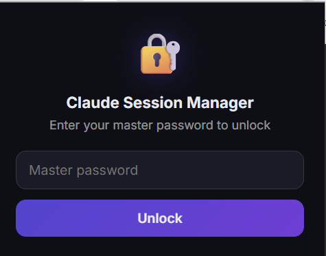
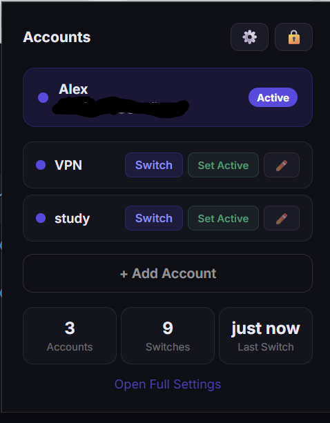
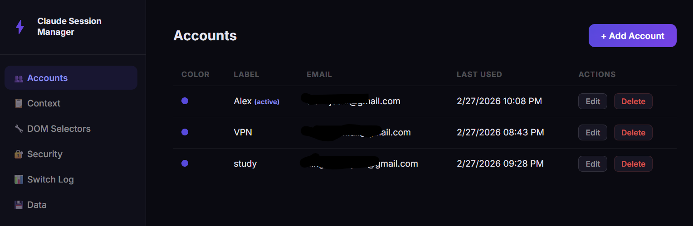
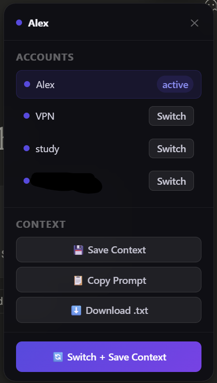
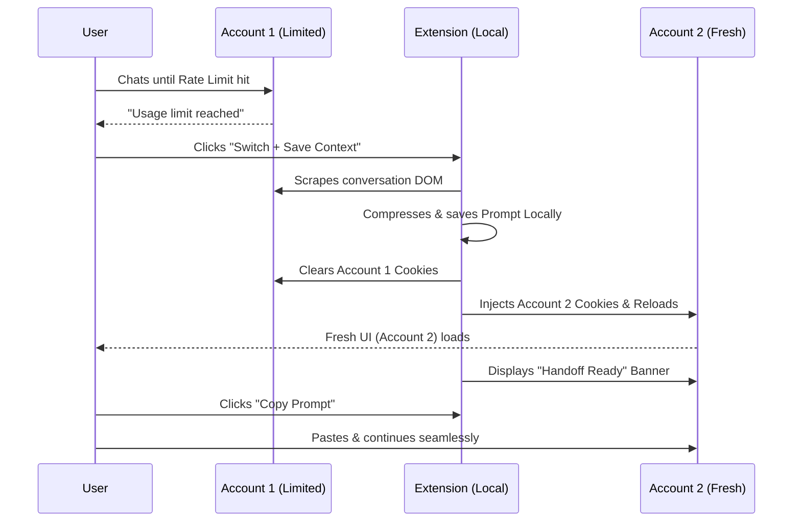
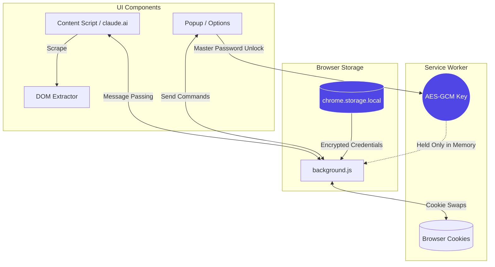

# Claude Session Manager

A powerful, privacy-first Chrome Extension for managing multiple Claude.ai accounts, seamless session switching, and intelligent context handoffs. Built specifically to solve the friction of hitting Claude's rate limits and needing to jump to a secondary account.

<!-- 
  To add your own screenshots:
  1. Create a folder named "assets" in the root of this project.
  2. Save your screenshot as "screenshot-main.png" inside that folder.
  3. GitHub will automatically render it here!
-->

## 📌 Features

- **⚡ Instant Account Switching**: Switch between Claude accounts in one click. No logging out, no entering passwords manually, no waiting.
- **🛡️ Privacy First & Local Only**: Your credentials and session cookies are stored *only* on your device. Emails and passwords are encrypted using AES-GCM with a Master Password that is never saved to disk.
- **🧠 Intelligent Context Handoff**: Hit a rate limit? Click "Switch + Save Context". The extension seamlessly scrapes your current conversation, switches accounts, and gives you a structured prompt to paste into the new session so you don't lose your train of thought.
- **⚠️ Rate Limit Detection**: Automatically detects when you hit Claude's rate limit and prompts you to switch accounts.
- **⚙️ Dynamic Selectors**: Claude updates their UI? No problem. The extension allows you to update the DOM selectors directly in the Options page so context extraction never breaks.
- **🔐 Auto-Lock**: The extension automatically locks its in-memory encryption key after a period of inactivity (default 30 mins) to protect your sessions.

---

## 🚀 Installation

Because this extension requires broad cookie permissions to function, it is best installed in Developer Mode.

1. Clone or download this repository.
2. Open Chrome and navigate to `chrome://extensions/`.
3. Enable **Developer mode** (toggle in the top right corner).
4. Click **Load unpacked** in the top left corner.
5. Select the folder containing `manifest.json`.
6. Pin the extension to your toolbar! ⚡

---

## 🛠️ How to Use

### 1. First-Time Setup
Click the ⚡ extension icon in your toolbar. You will be prompted to create a **Master Password**.
*Keep this password safe. If you lose it, you will have to reset the extension and lose your saved accounts.*

### 2. Adding Accounts
1. Once unlocked, click the **⚙️ Options** gear in the popup (or right-click the extension icon -> Options).
2. Go to the **Accounts** tab and click **+ Add Account**.
3. Give it a label (e.g., "Personal", "Work") and optionally enter your email/password credentials to keep track of them.
4. *Note: To actually "link" an account, you need to switch to it in the extension, then manually log into Claude.ai once. After that, the extension will save the session cookies and you can switch to it instantly.*

### 3. The Claude.ai Widget
When you visit `claude.ai`, you will notice a small pill widget in the bottom right corner showing your active account. 
- Click the pill to open the Quick Action Panel.
- From here, you can switch accounts instantly.
- You can also **Save Context**, **Copy Prompt**, or **Download** your current conversation.

### 4. Context Handoff Flow
When you hit a rate limit:
1. Open the widget and click **🔄 Switch + Save Context**.
2. The extension will scrape your conversation, save it to history, and switch you to your next account.
3. A green banner will appear at the top of the new Claude window. Click **Copy Prompt**.
4. Paste it into the chat box! Claude will read your previous context and pick up exactly where it left off.

---

## 🏗️ Architecture & Security

- **Manifest V3**: Fully compliant with modern Chrome security standards.
- **Service Worker (`background.js`)**: Handles all cookie swapping, tab refreshing, and encryption/decryption in memory.
- **Encryption**: Uses standard Web Crypto APIs (`AES-GCM` and `PBKDF2`).
  - Master Password -> Salted and Hashed -> Stored to verify login.
  - Master Password -> Decrypts the actual AES key -> Held *only in memory* while unlocked.
  - If the service worker goes to sleep or you close the browser, the key is wiped and the extension locks.
- **No APIs**: The extension does not make any external API calls. Context extraction is done strictly via client-side DOM parsing (`context-extractor.js`).

---

## 📄 License & Disclaimer

This is a local productivity tool. It is not affiliated with, endorsed by, or associated with Anthropic. Use responsibly and in accordance with Anthropic's Terms of Service. Please do not use this tool to abuse rate limits or bypass platform protections in an automated way.

*Designed for developers and power users who need uninterrupted workflow across their personal accounts.*
